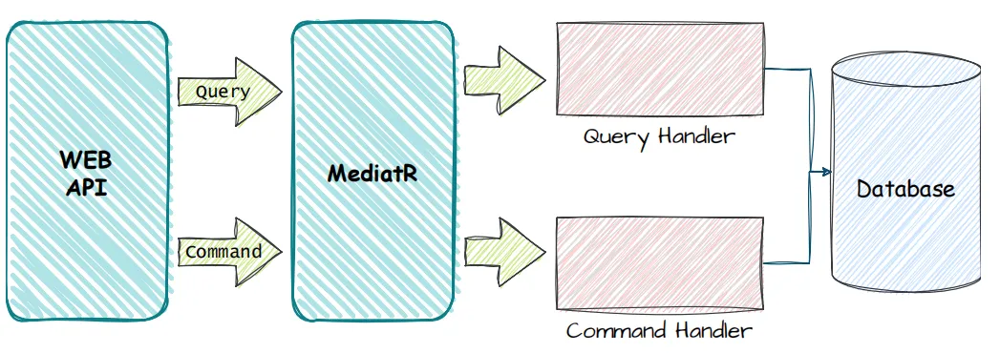

# Clean Architecture .NET Core C# CQRS

About the repository: Open source project written in the latest version of ASP.NET Core, implementing the concepts of DDD (Domain Driven Design), S.O.L.I.D, Clean Code, CQRS (Command Query Responsibility Segregation)

## Overview

This project serves as a robust and domain-focused backend solution, demonstrating key architectural concepts to ensure scalability, maintainability, and clarity.

## Table of Contents

- [Technologies](#technologies)
- [Architecture Overview](#architecture-overview)
- [Dependencies](#dependencies)
- [Running the Application](#running-the-application)
- [Running Tests](#running-tests)
- [License](#license)

## Technologies

- ASP.NET Core 8
- Entity Framework Core 8
- Dapper
- Unit & Integration Tests + xUnit + FluentAssertions
- MediatR
- FluentValidator
- Postgres
- Docker & Docker Compose

## Architecture Overview



The project follows the principles of Clean Architecture and Domain-Driven Design to ensure a separation of concerns and a focus on the core business logic. Key architectural layers include:

- Full architecture with responsibility separation concerns, SOLID and Clean Code
- Domain Driven Design (Layers and Domain Model Pattern)
- Domain Events
- Domain Notification
- Domain Validations
- CQRS
- Event Sourcing
- Unit of Work
- Repository Pattern
- Result Pattern

1. **Domain Layer**: Contains the domain entities, aggregates, value objects, and domain services.

2. **Application Layer**: Orchestrates the application's use cases by interacting with the domain layer. It's free from business logic but responsible for coordinating application behavior.

3. **Infrastructure Layer**: Implements the details of external concerns such as databases, external services, and frameworks. It includes repositories, database access, and external service integrations.

4. **Presentation Layer**: Represents API. It communicates with the application layer to execute use cases.

5. **Tests**: Include unit tests to ensure the correctness of the application.

## Dependencies

- [Entity Framework Core](https://docs.microsoft.com/en-us/ef/core/)
- [Dapper](https://github.com/DapperLib/Dapper)
- [MediatR](https://github.com/jbogard/MediatR)
- [FluentValidation](https://docs.fluentvalidation.net/en/latest)

## Running the application

After cloning the repository to the desired folder, run the command in the terminal at the root of the project:

```bash
dotnet clean && dotnet build
```

Next step, run the command in the terminal:

```bash
docker-compose up --build
```

## Running Tests

```bash
dotnet test
```

## License
This project is licensed under the [MIT License](LICENSE). See the LICENSE file for details.
